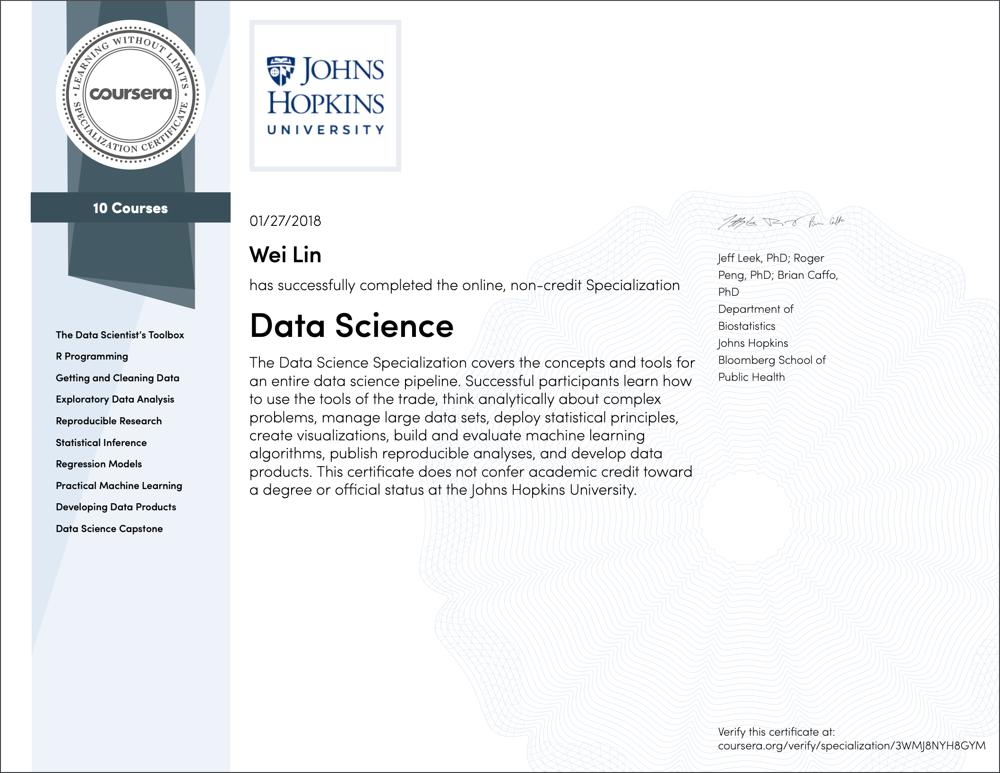

When I first joined Inspire, I actually had very limited data science knowledge and programming experience. In order to get myself up to speed, I searched online for a self-paced MOOC. One course that came up was the data science specialization from Johns Hopkins University on Coursera. Several reasons that I finally chose this specialization are:

1. It has decent online review and rating.
2. It is an R based course/specialization.
3. It covers almost all aspects of data science.

To be honest, the whole journey to complete this 10-course specialization is not that straight forward. I signed up the whole specialization at the beginning of 2016 and it took me almost two years to finalize it. The main reason is that Coursera did not require monthly subscription back in the old days and the course can be slowly taken in a period of two years with just one time upfront charge. Retrospectively, I guess I would finish it much earlier if I were under the current monthly subscription plan. Anyway, I finalized the whole specialization at the beginning of 2018. Let me first show you the certificate.

This specialization consists of 10 courses. I will briefly review each of them as follows.

### Course 1 The Data Scientist Toolbox
It is critical to choose a good tool set, which can often times double or even triple your work efficiency. When I just started using R, I did not do much research and used the command line R (not even vim) in linux for quite a while before finding Rstudio. The course covers most of the tools needed for R based data science work. In my view, the ranking of the tools are as follows

1. Rstudio: The most popular IDE for R. I should say R could not be that popular without Rstudio. Rstudio is continuously integrating functions to make R programming easier and faster. Autocomplete, hotkeys, Rstudio project ..., there are so many reasons to love Rstudio.
1. Git: The most popular version control program. Since Rstudio already has a very good git integration for basic usages, we just need to click the buttons in most of the cases. However, it is better to know more advanced git function, such as merge, rebase, branch, etc.
1. Rmarkdown: The all-in-one reporting tool in R. You can use Rmarkdown to create slides, jupyter like notebook, academic paper, interactive website, etc. Rstudio's integration of Rmarkdown is also perfect.

Clearly, the most important tool is Rstudio. Good job Rstudio!

### Course 2 R Programming
Knowing how R works is very important. Course 2 covers the basics of R programming. Besides regular programming topics such as data structure, flow control, function, etc., there are a few other interesting topics in this course:

1. Scoping Rules: R uses lexical scoping. In plain language, variables created at the same or above level that a function is defined can be used by that function. When I first started developing a R package, I wanted to reduce the number of function arguments and made an error of naively assuming one variable calculated in function A is available to function B called within A's body.

2. Xapply function family: R is most efficient if you use vector operations as much as possible. Other languages might still be most efficient using loops. I am not a fan of Xapply function family and rarely use them. In my personal view, it looks like a compromise between element wise thinking and vector wise thing. It is neither as flexible as loops nor as fast as vector operations.

As I said this course is a good starting point for R programming. I would highly recommend the book [Advanced R Programming](http://adv-r.had.co.nz/){:target='blank'} by Hadley Wickham if you want to learn more about R programming.

### Course 3 Getting and Cleaning Data
There are basically 2 parts of this course:

1. Getting Data: It is about how to get data locally and remotely from files, APIs, and databases. Pretty standard, nothing exciting.

2. Cleaning Data: It is about data manipulation and an important concept called "tidy" data.
    * Data Manipulation: this course mainly introduces the basic and `dplyr` way of manipulating data, however, I would highly recommend using `data.table` way of manipulating data. It is much faster to manipulate data than the previous two ways. I am also fascinated by how simple and concise the syntax of `data.table` is. It is definitely worth checking out.
    * Tidy Data: The idea of tidy data is used in a lot of R packages, such as `ggplot2` and is used in database table design for scalability. You will find much easier to deal with data if it is already in tidy format. It is a must to check out the paper ["Tidy Data"](https://www.jstatsoft.org/article/view/v059i10/v59i10.pdf){:target='blank'} by by Hadley Wickham. I will guarantee you that spending 30 min to read through this paper will make you a better data scientist.

### Course 4 Exploratory Data Analysis
This course is about exploratory data analysis, aka, EDA. To me, EDA is 90% about data visualization. Data visualization is very useful for finding outliers, skewness, correlation, etc. Generally speaking, after doing EDA, you should be able to form some basic hypothesis even without any modeling work. However, it is arguable of how much effort you should put into EDA in the entire data science workflow. Based on my personal experience, I do not put much effort in EDA simply because of the following reasons:

1. EDA is not a prerequisite for the model building. Even if you have a thorough EDA with beautiful charts and a basic idea of the distribution of each and every feature and how multiple features are correlated with each other, ultimately, you still need to build a predictive model based on the data. If the predictive model is working fine, it should confirm what EDA has shown.

1. There is no standard procedure for EDA. Unlike model building, there is very little theory and standard procedure that everybody should follow, which is what I fear the most.

1. Data visualization has its own limitation. There can only be a limited number of features that you can visualize on a single chart. It is unlikely to find complex relationship among multiple features simultaneously using graph, for which we then rely on complex modeling technique to find out.

Although I am not a fan of EDA, it is still a very important tool in business intelligence, reporting, and dashboarding, etc.

### Course 5 Reproducible Research
Personally, I don't think this course has much value except for the introduction of R markdown. As the title indicates, this course might be motivated from the academic research activities. For most data scientists in industry, the take-away from this course is that you should write down your data analysis into some type of reports, which can then be shared with and reproduced by others. Toward that, one of the best approaches in R is putting your data analysis, model building, and thought process down to a R markdown, while that counterpart using Python is the Jupyter notebook.

Currently, I use R notebook (still based on R markdown) much more often than the original R markdown because the R notebook is always cached for fast preview.

### Course 6 Statistical Inference
This is the hardest course to me and I've got the lowest score for this course in the entire specialization. I think most of students will agree with me. To be honest, I am still not quite fluent and comfortable in statistical inference as of today. Some of the important and practical concepts you will come across in this course are

1. P value. This is one of the most important concept when people are talking about statistical significance. I ask the definition of P value for almost all candidates if they are applying for a data science or analytics related position.

2. Hypothesis Testing. I should say testing is one of the most important concepts in any data-driven company. The popular AB test falls into this category. Rigorously speaking, before the company formally launches any new product, we should select in a subset of customers, perform the hypothesis testing, collect the data back, and confirm the benefit. In our business, some test can be fairly complicated and time consuming based on the metric we are trying to measure, such as attrition, life time value, etc.

### Course 7 Regression Models
Linear regression is most likely the first regression model that every introductory machine learning or data science course or book will talk about. Although linear regression seems pretty simple and straight forward, there are indeed quite a bit of technical details in it. This course is dedicated to the generalized linear model and covers these technical details pretty well. The following concepts is worth being paid more attention to.

1. Interpretation of regression coefficients. This is especially important when it comes to multi-variable linear regression. The coefficient of an independent variable is the sensitivity of the dependent variable to that independent variable holding other dependent variables constant. When some of the independent variables are somehow correlated, i.e., dependent with each other, the independency assumption is violated and their regression coefficients might show counter intuitive values, which is a result of so called multi-collinearity.

2. Model Selection. The course presents the traditional model selection method, i.e., backward, forward, and both based on the AIC or BIC. In practice, I almost always use generalized linear model with LASSO to perform the model selection in company with n-fold cross validation. To me, it is much more intuitive and understandable.

3. Logistic Regression. In practice, I found logistic regression one of my most commonly used classification models, especially in the early stage of model development. Logistic regression as a generalized linear model is fast to train and very interpretable. We use it a lot at Inspire.

### Course 8 Practical Machine Learning
This course is one of the most important courses if you are serious about pursuing a machine learning career. A lot of practical techniques and details are covered by this course. I could not tell which part is more important in this course because I think each and every topic is equally important and you will probably come across all of them later in your machine learning career.

This course introduces the caret package, which is an all-in-one machine learning package. This package is suitable for problems with small amount of data. However, the execution speed of caret is pretty slow and the documentation is terrible. I think the caret package is a little outdated and there is little maintenance going on for it. In practice, I use the H2O r package most of time. I highly recommend H2O package. You will be amazed by its speed and great documentation.

### Course 9 Developing Data Products
I believe that an important factor of a successful data science career is about making impact in the business. You want the business stake holder to agree with your and buy in. To achieve this, one of the best ways is to make a data product. It could be an API, a dashboard, an automated report, or a website, etc. They are all scalable products to impact the business. This course introduces a few data products you can make using R. Nevertheless, it is an introductory course and you should a lot of external resources on data product.

At Inspire, the biggest data product I built is a Shiny based interactive dashboard. Unlike any business intelligence tool, the advantage of Shiny dashboard is that it is fully interactive, meaning you are able to perform input and output tasks through it. As such, the dashboard I built could function like a portal for some users.

I like building product and I believe an end to end data scientist is who should be able to perform data tasks from ETL to data product.

### Course 10 Data Science Capstone
All right, once you've reached to this step, it is the last course in this specialization. To be honest, the project itself in the capstone is not that straight forward and you need to learn and get information outside this course. Since students might have different approaches to solve the problem, there is no unique answer and the scoring criteria is pretty loose.

Along the journey of finishing this specialization, I tried my best to use Github. All of my code for the assignments and projects is stored in this [repository](https://github.com/wlinInspire/JHU-Coursera-Data-Science){:target='blank'}.
